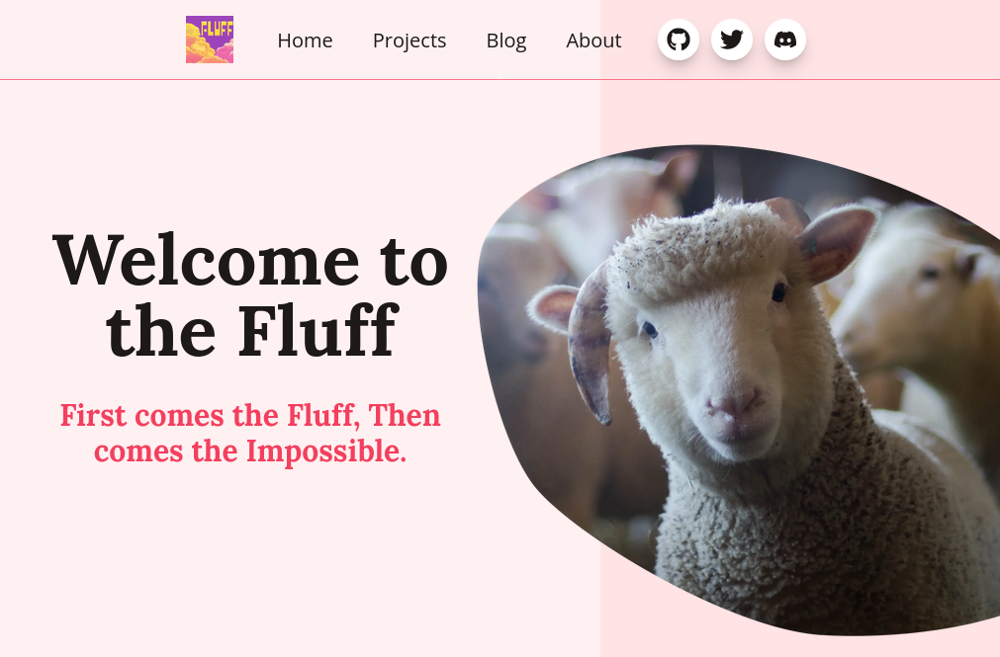
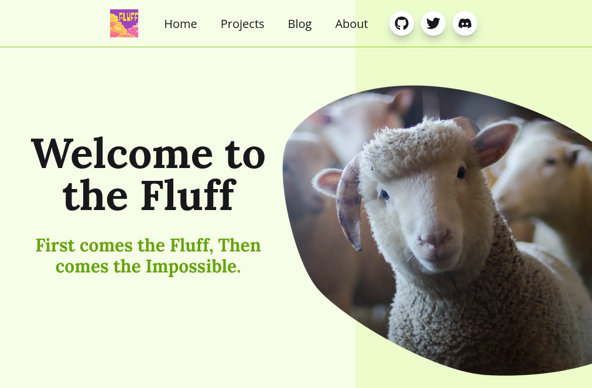
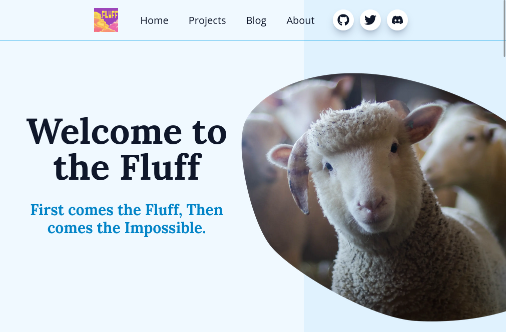
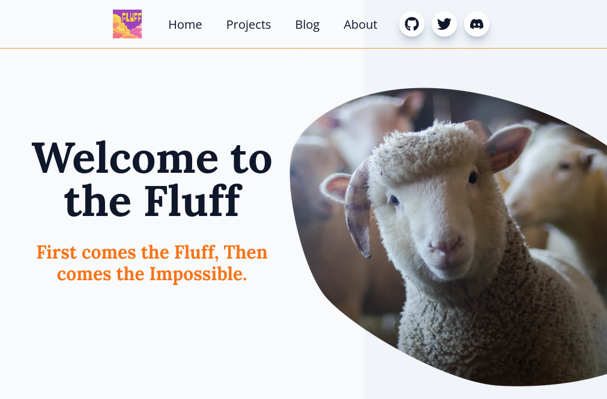
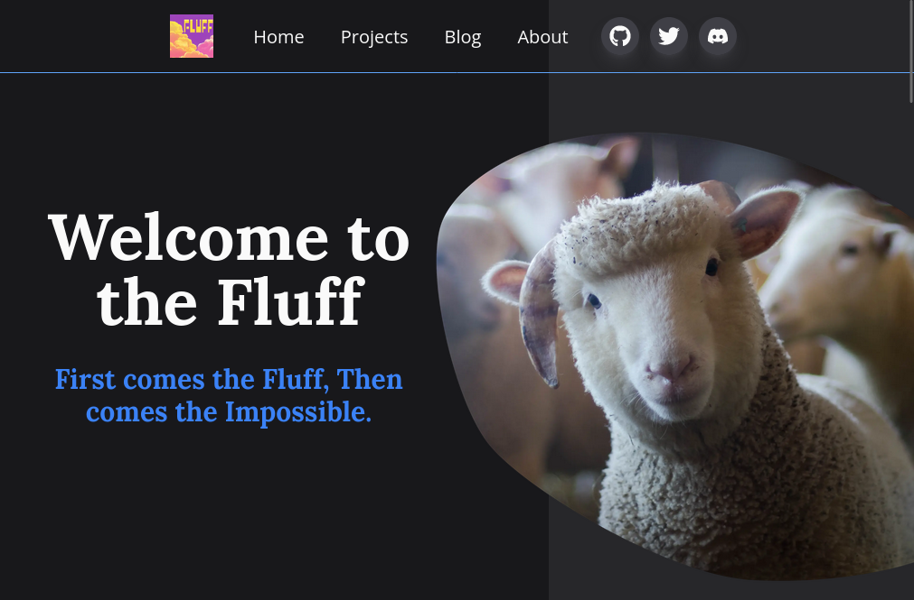

## Fluff



Deployed here:

[https://fluff.vercel.app/](https://fluff.vercel.app/)


## Setup

Start by **forking** this repo then clone it on your machine with nodejs installed.

Go to the `fluff.config.js` file and start _naming_ your website and _write_ a description.

You can change the author, it's you now, this code is MIT, just keep the License for other to find and go wild.

Change the look and feel of the website in the `styles/globals.css` file, there are some themes, make your own.

Replace the images in `public` with your assets, or grab some from [Pexels.com](https://pexels.com) like I did.

Install the dependencies using `npm install`

Start the server using `npm run dev`

## This is my blog

Write your own **projects.mdx** in `pages/projects/` and they will get sourced.

_Link up_ an API for the blog, or use the projects code to start blogging in mdx.

Add pages and links to the config AND translations, add social hooks.

_Deploy_ your repo anywhere !

## Going further

Implement Searching, catégories, auto tag catégories, comments, code localized projects ...

## Thanks !

Send a screenshot to me [@koalabearfr](https://twitter.com/koalabearfr) on twitter and I'll add it to the repo

## Themes

theme-fluff


theme-lime


theme-sky


theme-pro


theme-dark


## Default Readme kept Below

This is a [Next.js](https://nextjs.org/) project bootstrapped with [`create-next-app`](https://github.com/vercel/next.js/tree/canary/packages/create-next-app).

## Getting Started

First, run the development server:

```bash
npm run dev
# or
yarn dev
```

Open [http://localhost:3000](http://localhost:3000) with your browser to see the result.

You can start editing the page by modifying `pages/index.js`. The page auto-updates as you edit the file.

[API routes](https://nextjs.org/docs/api-routes/introduction) can be accessed on [http://localhost:3000/api/hello](http://localhost:3000/api/hello). This endpoint can be edited in `pages/api/hello.js`.

The `pages/api` directory is mapped to `/api/*`. Files in this directory are treated as [API routes](https://nextjs.org/docs/api-routes/introduction) instead of React pages.

## Learn More

To learn more about Next.js, take a look at the following resources:

- [Next.js Documentation](https://nextjs.org/docs) - learn about Next.js features and API.
- [Learn Next.js](https://nextjs.org/learn) - an interactive Next.js tutorial.

You can check out [the Next.js GitHub repository](https://github.com/vercel/next.js/) - your feedback and contributions are welcome!

## Deploy on Vercel

The easiest way to deploy your Next.js app is to use the [Vercel Platform](https://vercel.com/new?utm_medium=default-template&filter=next.js&utm_source=create-next-app&utm_campaign=create-next-app-readme) from the creators of Next.js.

Check out our [Next.js deployment documentation](https://nextjs.org/docs/deployment) for more details.
